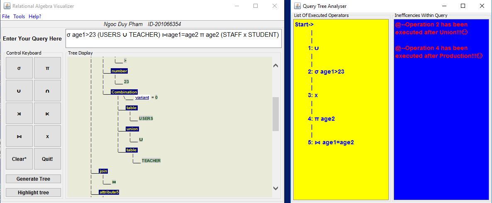

# Relational Algebra Visualizer
**Relational Algebra Visualizer** is a Java application which is used mainly to translate a Relational Algebra query into a query tree for IT learners. Moreover, the application is also able to hightlight inefficencies within the query as well as allows users to save the tree graph for later purposes. In term of implementation, it was integrated with generated code from JFlex, CUP and DJNativeSwing library.  

The tool has been developed by **Ngoc Duy Pham** for the final year project supervised by **Dr. Floriana** and **Dr. David** at **University of Liverpool**.  

In addition, a big thank to **Dr. Maduka** who suggested me many helpfull ideas to accomplish this project.  

## Screenshots
**Alerting Syntax Errors of Query**

**Visualising Queries and Highlighting Inefficencies**

**Searching Information on Internet**

## How to use it?
The application can only be run on Window 64-bit.  
MacOs and Unix/Linux distributions do not support it very well.

- **Step 1**: download and install java jdk in your machine.

- **Step 2**: Put the package in C drive 
        or any its sub-directories.

- **Step 3**: Click on run.bat file to run the system.

## Accessing the user guideline within the system for more details!
